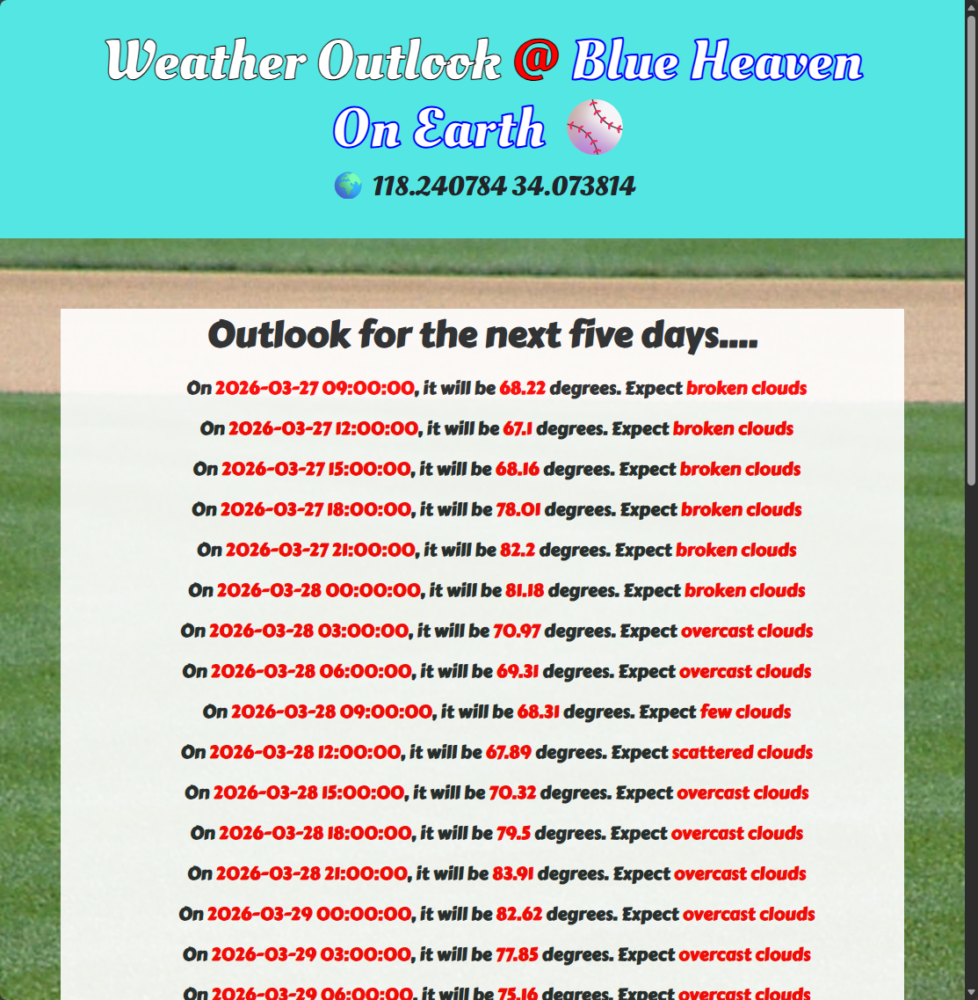

# WebDevBootcamp-Capstone4-WeatherData-Website

## Overview
Capstone Project 4 requires the use of a public API. The project takes the concepts learned from the previous sections and tests one's ability on the subjects. Subjects include API requests, EJS, and Express routes.

My spin on this website uses the [Open Weather Maps 5 Day 3 Hour API](https://openweathermap.org/forecast5) to display weather data from Dodgers Stadium over the course of five days. That data is then rendered on the index page using EJS as depicted in the screenshot at the bottom of this document.

### Modules Used
#### Express
**Express** is the backend server running the application. This project is fairly simple and only has an index page.

#### EJS
**EJS** is used to render weather data on the index.ejs file. This is accomplished with a for loop to create a list of the data displayed.
#### Axios
**Axios** is used to make a request to the [Open Weather Maps 5 Day 3 Hour API](https://openweathermap.org/forecast5). That API returns weather data for the given location for every three hours over five days.
#### Dotenv
Although not covered in this course (up to this point), **dotenv** was used to store envirnment variables in a .env file.

### Ideas for improvements
#### Fix Rendered Data
Currently the data displayed on this website is exactly as pulled from the JSON data that is returned. Some improvements that could be made would be to make the text for the date and time more reader friendly. That data is pulled from a string that is returned. The values could be split up and reworded. Additionally the time stamps can be formatted to use a 12 hour format vs 24 hour.

Additionally, emojis could be displayed on the website depending on the weather condition to make the website more interesting to look at.

#### Update Webpage Styling
The styling on this website is fairly basic and looks like something from the early 2010s. The goal of this website was to display data pulled from an API and display it on a web page. Styling changes and even routes could be added to make the website appear more modern.

## Screenshot
